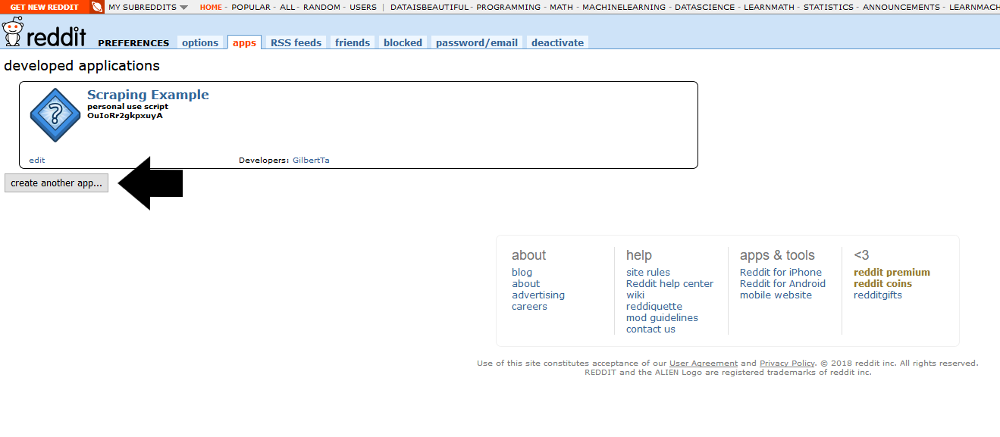
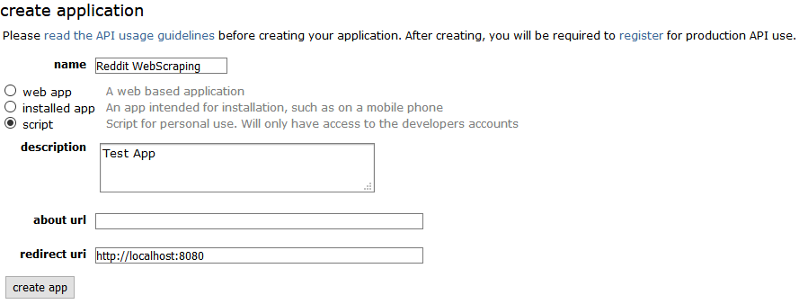
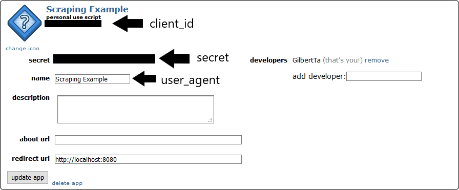

## Introduction
This is a Reddit scraper that can be used to scrap subreddits and comments from submissions.
The library we use in Python is PRAW and you will need your own reddit account and API credentials for PRAW.
This scaper will store the following information:
* post_id
* subreddit_name
* post_title
* post_body
* visual_content_url
* srape_time
* post_author
* post_publish_date
* post_comments

## Getting Reddit API credentials. 
Reddit is an American social news aggregation, web content rating, and discussion website whereas subreddit is a powerful network of niche communities that collectively define reddit. To scrap reddit submissions, you would need to get Reddit API credentials. 

To get the authentication information, you need to create a reddit app from https://www.reddit.com/prefs/apps.
You need to firstly click **create app** or **create another app**.

This will open a form where you need to fill in the app's name, description(optional) and the redirect uri. For the redirect uri you should write: http://localhost:8080

After pressing "create app", you can find the authentication information needed to create the **praw.Reddit** instance. You should save the **personal use script**, **secret key** and **user agent** to somewhere safe.

## Getting Started
Praw can be installed using pip. After installing, you can import Praw by:
`import praw`  
`import pandas as pd`  

Here we only scrap those posts with visual content. We use the `post.is_self` to check whether a post only include text.  

Store the credential informations as **client_id**, **client_secret**, **user_agent** and execute the following functions:  
`reddit = get_reddit(client_id,client_secret,user_agent)` 

You can now get the scrap results with `get_posts_result` by puting the reddit, keyword indicating the subreddit you want to scrap, and the maximum posts you need as parameter.  

`posts_df = get_posts_result(reddit,'Shoes',100)`  

Before exporting the dataframe into Sqlite3, we still need to transform the data type of the dataframe into the type that Sqlite3 accept. Execute the following:  
`posts_df = transform_posts_results(posts_df)`  

## Exporting Pandas Dataframe into Sqlite3
After converting the column data type into data type that SQL database can accept, we can now export the pandas dataframe to sqlite3 with sqlalchemy.
* SQLite is a relational database management system contained in a C library
* Sqlalchemy is an open-source SQL toolkit and object-relational mapper for the Python programming language released under the MIT License. We can use SQLAlchemy to create a connection to a new SQLite database, which will be store with a name that we defined.

We can import sqlite3 and sqlalchemy with the following code:  
`import sqlite3`  
`import sqlalchemy as db`  
`from sqlalchemy import create_engine`  

Then we can export the pandas dataframe (here we name it "reddit_shoes") into database named "reddit_shoes" (you can define your own database name):  
`engine = create_engine('sqlite:///reddit_shoes.db',echo=True)`  
`sqlite_connection = engine.connect()`  
`sqlite_table="reddit_shoes"` 
`posts_df.to_sql(sqlite_table,sqlite_connection,if_exists='replace')` 

## Viewing scrap table from command line
If you want to view the table from the shell, you can type the following to check out the database.  
Here the name of our database is "reddit_shoes"  
`open reddit_shoes.db`  

You can also check out all the tables from this database using the following:  
`.tables` 

Then you can see the table content with this command:  
`select * from reddit_shoes;`

